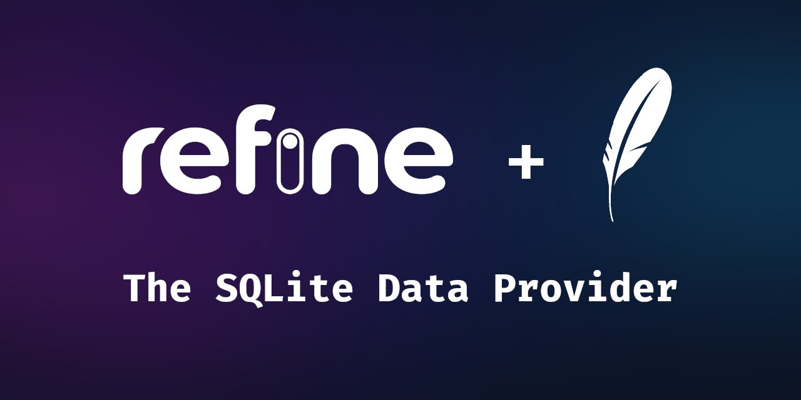

# refine-sqlite

> **Warning**
> Work in progress, built using code from https://github.com/refinedev/refine/tree/master/packages/simple-rest

Start the development of your next refine app with a lightweight local database!

This integration with the [refine](https://refine.dev/) framework makes the lightweight [SQLite](https://www.sqlite.org/index.html) database available for usage within your app, with simple methods like `getList`, `create`, `update`, and more! 

> **Note**
> Check out all the methods available [here](https://refine.dev/docs/api-reference/core/providers/data-provider/#methods).